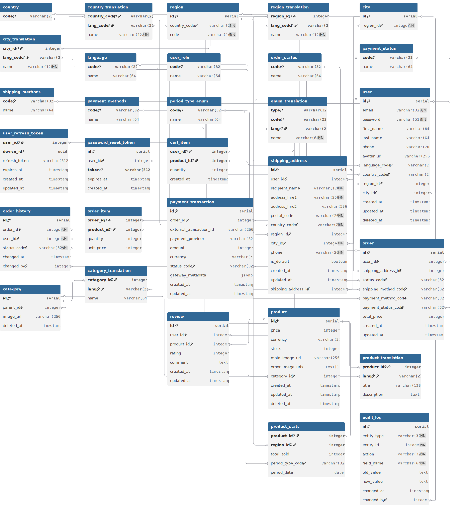

# Online Store

## Installation

Use the package manager [yarn](https://classic.yarnpkg.com/lang/en/docs/install/) to install all dependencies.

### Clone repository

```bash
git clone https://github.com/Kentypa/Online-Store
cd Online-Store
```

### Install Frontend Dependencies

```bash
cd apps/frontend
yarn install
```

### Install Backend Dependencies

```bash
cd .../backend
yarn install
```

### Docker

Install [docker](https://www.docker.com/products/docker-desktop/) into system

## Startup

To run project write from main directory

```bash
docker-compose up --build
```

To close project write from main directory

```bash
docker-compose down
```

To close project with remove volumes

```bash
docker-compose down -v
```

## Project Structure

```bash
Online-Store/
├── apps/
│   ├── frontend/   # React
│   └── backend/    # NestJS
├── docker-compose.yml
├── database-prototype.dbml # Prototype database in dbml language
├── database.env
├── online-store.code-workspace # Workspace settings for Visual Studio Code
└── README.md
```

## Usage

### After run docker-compose(with default .env parameters):

- frontend can be open at [http://localhost:5173](http://localhost:5173)
- backend can be open at [http://localhost:3000](http://localhost:3000)
- api documentaion can be open at [http://localhost:3000/api](http://localhost:3000/api)
- adminer can be open at [http://localhost:8081](http://localhost:8081)
- maildev can be open at [http://localhost:1080](http://localhost:1080)
- redis can be open at [http://localhost:6379](http://localhost:6379)

### Recommended Code Editor - [VSCode](https://code.visualstudio.com/)

To open project use VSCode

- Open VSCode
- File > Open Workspace from File > online-store.code-workspace

## Stack technology

### Backend:

- [NestJS](https://nestjs.com/) — A progressive Node.js framework for building scalable and modular server applications.
- [Passport](https://www.passportjs.org/) — Authentication Middleware.
- [Passport-Local](https://www.passportjs.org/packages/passport-local/) — Strategy for authenticating with a username and password.
- [Passport-JWT](https://www.passportjs.org/packages/passport-jwt/) — Strategy for authenticating with a JSON Web Token
- [TypeORM](https://typeorm.io/) — ORM for work with databases.
- [Bcrypt](https://www.npmjs.com/package/bcrypt) — Data hashing library.
- [Class-validator](https://github.com/typestack/class-validator) — Validation DTO.
- [Class-transformer](https://github.com/typestack/class-transformer) — Transforming DTO.
- [Multer](https://www.npmjs.com/package/multer) — Middleware for handling file uploads.
- [Swagger](https://swagger.io/) — API documentation generation.
- [Cookie-parser](https://www.npmjs.com/package/cookie-parser) — For work with cookies.
- [Jest](https://jestjs.io/) — Unit and e2e testing.
- [Nodemailer](https://nodemailer.com/) — Email sender.
- [KeyvRedis](https://www.npmjs.com/package/@keyv/redis) — Backend for caching as redis.
- [CacheManager](https://www.npmjs.com/package/cache-manager) — Caching with using cache-manager.
- [Schedule](https://www.npmjs.com/package/@nestjs/schedule) — Scheduling background tasks (cron, timeout, interval).
- [Faker](https://fakerjs.dev/) — Generating fake data.
- [Pug](https://pugjs.org/) — Template engine for sending emails.

### Frontend:

- [React](https://react.dev/) — Declarative UI library for building interactive user interfaces.
- [React Router](https://reactrouter.com/) — Client-side routing solution.
- [Redux Toolkit](https://redux-toolkit.js.org/) — Standard approach for efficient Redux development.
- [React Redux](https://react-redux.js.org/) — Official React bindings for Redux.
- [TanStack Query (React Query) ](https://tanstack.com/query/latest) — Powerful data-fetching and caching solution.
- [Axios](https://axios-http.com) — Promise-based HTTP client for APIs.
- [Tailwind CSS](https://tailwindcss.com/) — Utility-first CSS framework for rapid UI development.
- [Cypress](https://www.cypress.io/) — End to end and components testing
- [i18n](https://tailwindcss.com/) — Internationalization
- [Swiper](https://swiperjs.com/) — Carousel

### Database:

- [PostgreSQL](https://www.postgresql.org/) - The World's Most Advanced Open Source Relational Database

### Adminer:

- [Adminer](https://www.adminer.org/en/) - GUI Database managment

### Redis:

- [Redis](https://redis.io/) - In-memory data structure store for caching

### Maildev:

- [Maildev](https://github.com/maildev/maildev) - Email client

### Database Relationships diagram


